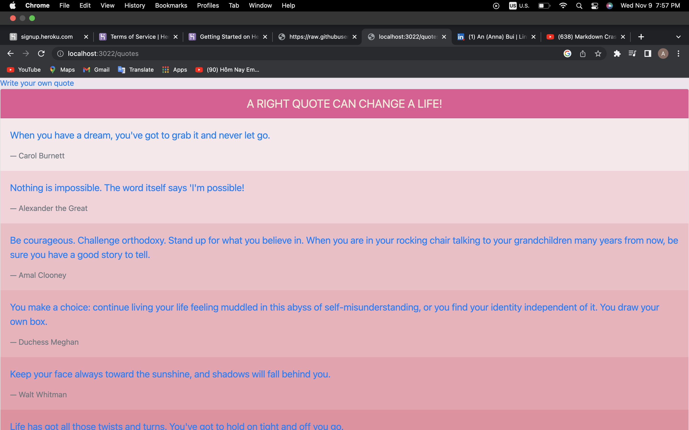
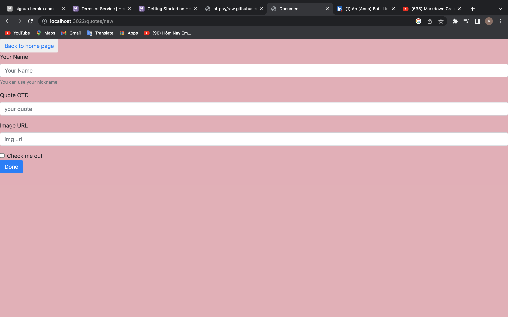
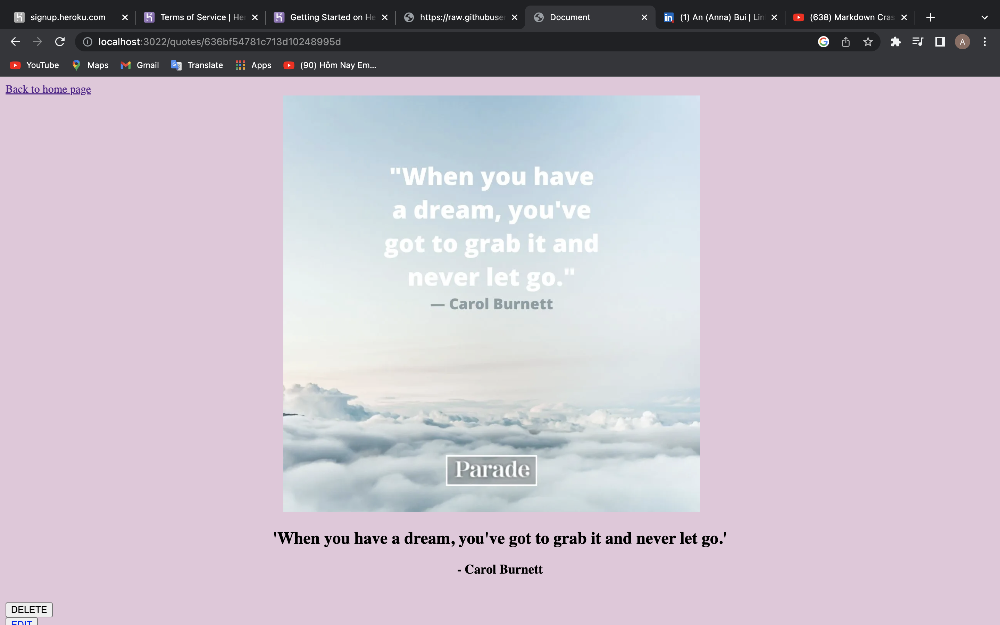

# Building A Full CRUD Application
### In this project, i'm  going to create node CRUD application with express and mongodb.

===========

# Project Idiea
### I'm building an app that shows the positives quotes. 
===============
# Goal
1. Create a new quote
2. Able to view each quotes
3. Edit quote
4. Delete quote
5. View all quotes on main page

==================

## Screenshots

===========

## preview
###To access the applications go to the URL <http://localhost:3022/quotes>

